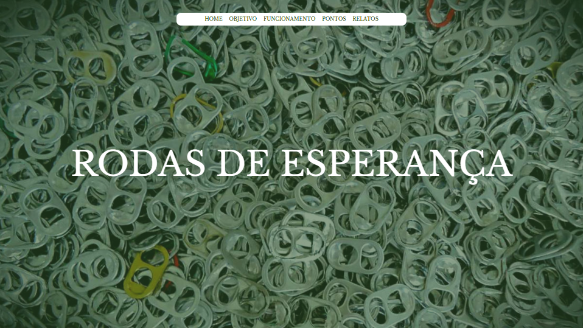

# RODAS DA ESPERANÇA

## Sobre

Site do tipo Landing Page para dilvulgar o projeto solidário sobre a coleta de lacres para troca por uma cadeira de rodas.
O intuito desse projeto é colocar em prática o conhecimento adquirido sobre as linguagens de marcação, HTML, CSS e Markdown, realizadas no curso técnico de desenvolvimento de sistemas [SENAI Jandira](https://sp.senai.br/unidade/jandira/).

## Tecnologia utilizadas
- HTML;
- CSS;
- Markdown;
- GIT;

## Autor

-[Gabriel Silva Guedes](https://www.linkedin.com/in/gabriel-guedes-84b507327/)